### LITA CAPSTONE PROJECT
### SALES PERFORMANCE ANALYSIS FOR A RETAIL STORE

## Project Overview
Retail businesses rely heavily on data to understand customer behavior, optimize inventory, and increase sales. This project, 
Sales Performance Analysis for a Retail Store, aims to analyze historical sales data to derive actionable insights that can help drive data-informed business decisions. 
This analysis will examine various aspects of sales performance, including trends over time, high-performing products and categories, and customer purchasing patterns. 
The insights from this project are intended to assist retail management in optimizing marketing strategies, inventory planning, and customer engagement.

### Project goals
- The main goals of this project are:
- Analyze and visualize sales trends to help the business understand seasonal effects and forecast future sales.
- Identify top-performing products and categories to assist with inventory management and targeted promotions.
- Segment customers based on purchasing behavior to enable personalized marketing strategies and improve customer retention.
- Generate actionable business insights that can inform decision-making across marketing, operations, and inventory management.

  ### Table of Contents
  - Project Overview
  - Objectives
  - _Dataset
  - Technology used
  - Project structure
  - Result and Findings
 
    ## Dataset
    **Source**: Proprietary retail sales data
    
    **Description**: The dataset includes transactions records with fields like
    'OrderID,'Customer Id','Product','Region','OrderDate','Quantity','UnitPrice'.
    
    **Note**: The data has been cleaned and anonymized for analysis purpose.

    ## Tools Used

In this project, Excel, SQL, and Power BI were used in combination to provide a comprehensive analysis of sales performance. 
Each tool served a specific purpose, ensuring that data processing, analysis, and visualization were handled efficiently and effectively.

1. *Microsoft Excel*
   - Used for initial data cleaning, exploration, and preliminary analysis.
   - Enabled rapid data inspection with pivot tables, filtering, and basic aggregations.

2. *SQL (Structured Query Language)*
   - Enabled advanced data querying and transformation, allowing efficient analysis of large datasets.
   - Facilitated complex aggregations and customer segmentation to derive deeper insights.

3. *Microsoft Power BI*
   - Used to create interactive dashboards and visualizations for presenting findings.
   - Allowed stakeholders to explore data dynamically by category, time period, and customer segment.
   - Integrated data from multiple sources, providing a unified reporting solution.
  

### Project Structure
This repository is organized to provide a clear view of the analysis process and findings for the "Sales Performance Anaysis for a Retail Sore" project.
Each folder and files servs a specific purpose, from data storage to scripts,notebooks,and reports,ensuring the project is well-documented and easy to navigate.

Below is a summary of the project structure.
### Dataset
The original dataset can be accessed directly in the ['data/'SalesData.xlsx) folder of this repository

### Data Cleaning and Transformation
To prepare the raw sales data for anaylsis, i performed the following steps:
1. **Removed Duplicates**: Ensured data accurracy by eliminating duplicate entries, allowing each sales transactions to be unique.
2. **Created Pivot Tables for Aggegation**:I used pivot tables to organize the data and calculate key metrics, such as

   A. Sum of Total revenue by Product
   

B. Regional Performance

C. Top Selling Product

D. Top Selling Product By Region

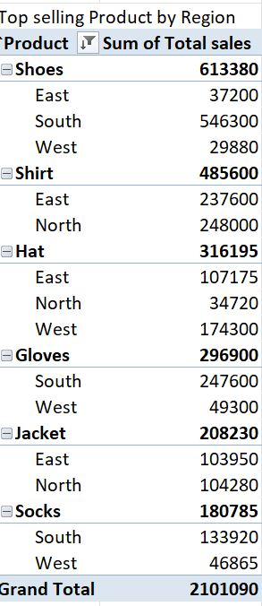

E.Sum of Total Revenue by Month

  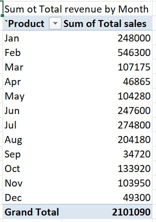

3. **Use Excel formulas to calculate metrics such as**:
   - average sales per product
  
     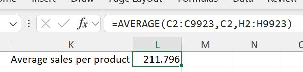

     - total revenue by region
    
       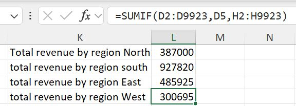

4  Then i Wrote queries to extract key insights based on the following

- retrieve the total sales for each product category.

  
  
- find the number of sales transactions in each region.

  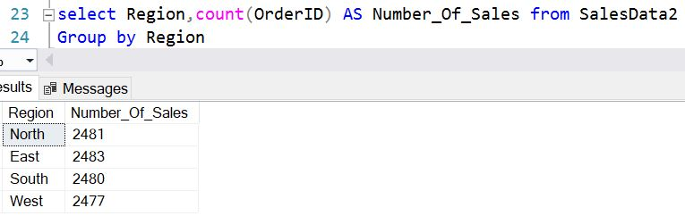
  
- find the highest-selling product by total sales value.

  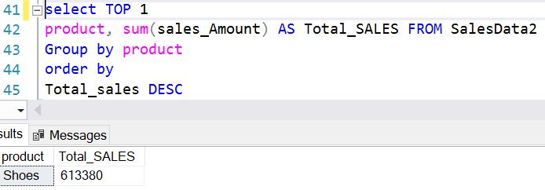
  
- calculate total revenue per product.

- 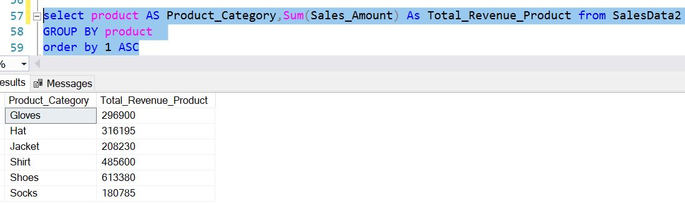
  
- calculate monthly sales totals for the current year.

- 
  
- find the top 5 customers by total purchase amount.

  
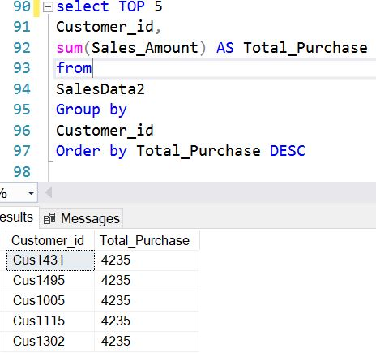

- calculate the percentage of total sales contributed by each region.

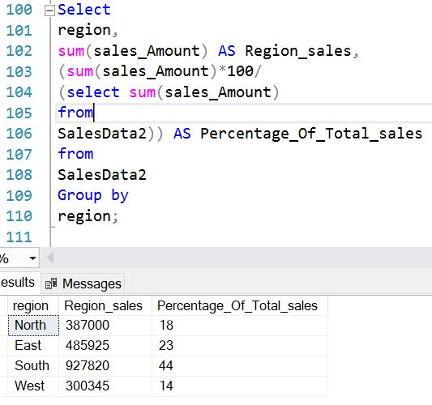
  
- identify products with no sales in the last quarter.

  
  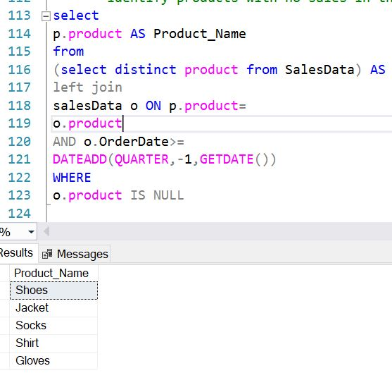

  
5. Then i Create a dashboard that visualizes the insights found in Excel and SQL.
   The dashboard include a sales overview, top-performing products, and regional breakdowns.

   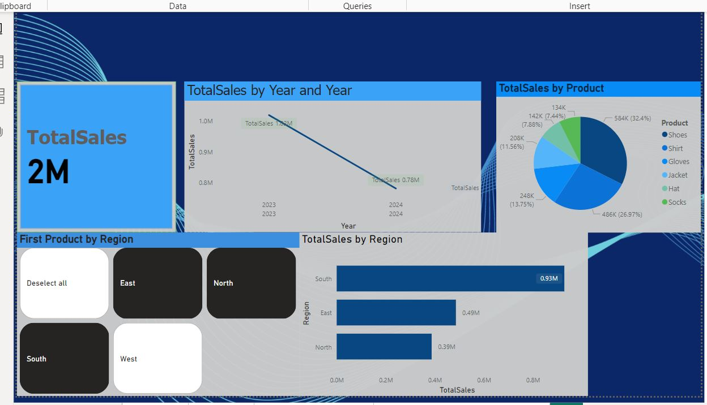

   ### Key Insights
   **Product Performance**
- Product Shoes has the highest total sales accounting for 29% of total revenue.
- Product Hat showed a steady increase in sales over the last quarter.

  **Regional Analysis**:
  -The South Region generated the most revenue,with a total of $927,820 in sales.
  - Followed by East Region with a huge significant diffrence in sales.
 
  ### Implications
  These findings suggest that the company should focus on boosting the marketing efforts for Product Socks,Jacket and gloves
  and exploring strategies to enhance sales in the North and west Region.

  ### Future Recommendations
  - Conduct a more detailed analysis on customer preferences to tailor product offerings,
  - Implement targeted marketing campaigns in underperforming regions.
  - Regularly update ongoing monitoring of performance trends.

    

